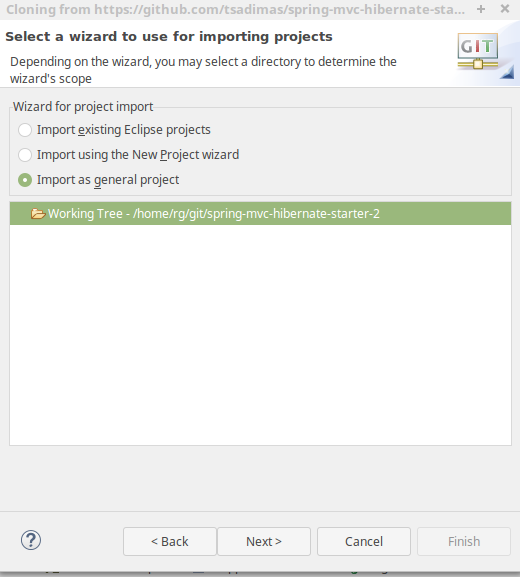
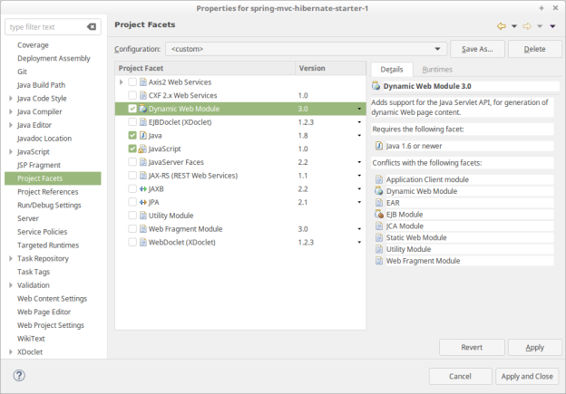

# spring-mvc-hibernate-starter

## Clone Project into Eclipse

File -> Import -> Git/Projects from Git -> Clone URI

the project url is 
[https://github.com/tsadimas/spring-mvc-hibernate-starter.git](https://github.com/tsadimas/spring-mvc-hibernate-starter.git)

when the prompt to select the kind of project appears, select *Import as general project*

Next, you should convert the current project to Dynamic Web project.
To accomplish this, you should right-click the project and in properties go to *Project Facets*
and select _Dynamic Web Module_ from the facets list.

Set the default JRE runtime to be Java 8. To accomplish this, right click the project and in _Java Build Path_, in Libraries Tab edit the _JRE System Library_ to point to your Java 8 runtime (setting the appropriate value to Alternate JRE).

To fix the errors in jsp files, you should again right click the project, and in properties go to _Targeted Runtimes_ and select the Apache Tomcat that is connected to your eclipse workspace.

